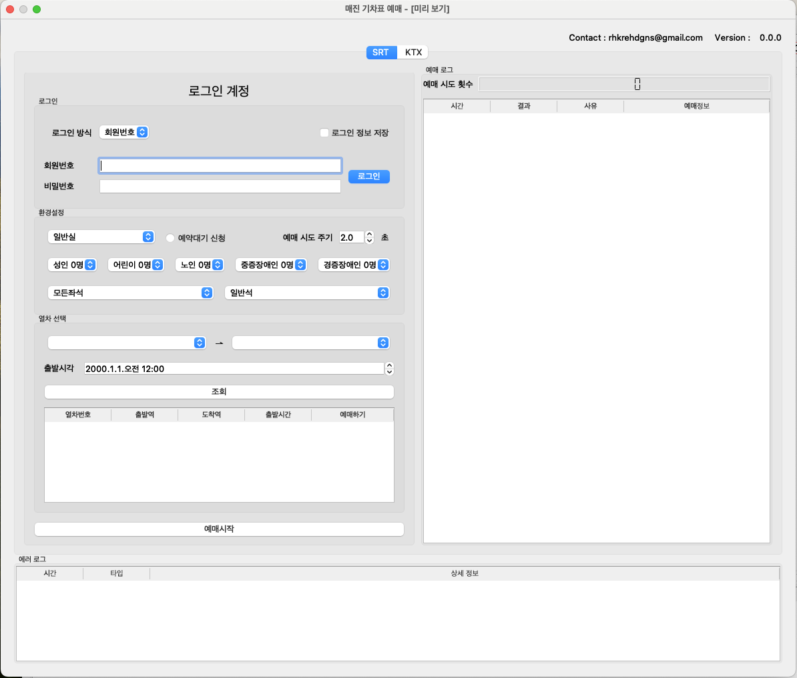

*2025년 3월 27일 공지*  
KTX 사이트 개편 이후 프로그램이 동작하지 않습니다.  
업데이트 중이오니 기다려주시면 감사하겠습니다.  
본업이 따로 있고, 바쁜 시기라 즉각 업데이트가 불가합니다.  
4월 1주차까지는 수정되도록 노력해보겠습니다.  
+ SRT도 일부 오류 보고가 있어 한 번에 수정하겠습니다.    

# SRT/KTX 예매 프로그램

매진된 기차표 예매를 도와주는 파이썬 프로그램입니다.  
원하는 표가 나올 때 까지 새로고침하여 예약을 시도합니다.

## 다운
[릴리즈](https://github.com/dhgwag/train_reservation/releases/latest )에서 최신 파일 다운로드  
Windows : 기차표예매.exe  
Mac OS(OS X) : 기차표예매.app

## 실행 결과

## 참고 사항
로그인 정보 저장은 반드시 개인 PC에서만 사용하세요.  
예매와 관련된 분쟁에 대한 책임은 모두 사용자에게 있습니다.  
본 프로그램은 예매 성공을 보장하지 않습니다.
